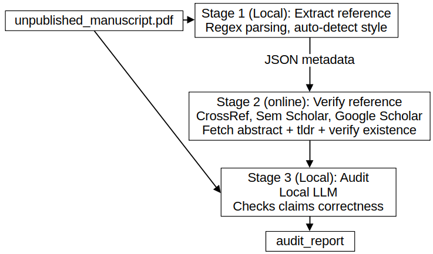

# local-llm-ref-verifier

Privacy-preserving citation verification for unpublished research manuscripts. The manuscript text never leaves your local machine.

## How it works

Three-stage pipeline:



1. **Extract** (local, no internet) -- Parses the PDF reference section using regex. Auto-detects citation style (APA, IEEE, Vancouver, Harvard, Chicago). Outputs structured JSON.
2. **Verify** (online, metadata only) -- Checks each reference title/author against CrossRef, Semantic Scholar, and Google Scholar APIs. Only minimal metadata is sent. Computes confidence scores via fuzzy matching. Also fetches paper abstracts and summaries (when available) for correctness checking in Stage 3.
3. **Audit** (local, no internet) -- Uses a local LLM (Ollama) to compare the manuscript body against verified references. Flags uncited references, missing citations, year mismatches, misquoted claims, and unsupported claims. Uses fetched abstracts/summaries to verify that the manuscript accurately represents the cited work.

## Install

```
pip install -e ".[dev]"
```

Requires [Ollama](https://ollama.com) for Stage 3 only:

```
ollama pull llama3.1
```

## Usage

Run the full pipeline:

```
ref-verifier run paper.pdf -o output/ -m llama3.1
```

Or run stages independently:

```
ref-verifier extract paper.pdf -o refs.json
ref-verifier verify refs.json -o verified.json
ref-verifier audit paper.pdf verified.json -o report.json -m llama3.1
```

Options:

- `-s / --style` -- Force citation style (`apa`, `ieee`, `vancouver`, `harvard`, `chicago`). Auto-detected if omitted.
- `-m / --model` -- Ollama model name (default: `llama3.1`). Only used by `audit` and `run`.
- `--google-scholar` -- Enable Google Scholar fallback (slow, rate-limited).
- `-v / --verbose` -- Verbose logging.

## Output

Each stage produces a JSON file:

- `extracted_references.json` -- Parsed references with authors, title, year, journal, volume, pages, DOI.
- `verification_results.json` -- Verification status (verified/ambiguous/not_found), confidence scores, canonical metadata, abstracts, and TLDR summaries.
- `audit_report.json` -- Citation issues list with severity and a human-readable summary.

## Project structure

```
src/ref_verifier/
  cli.py              CLI entry point
  models.py           Pydantic data models
  pdf_parser.py       PDF text extraction
  reference_extractor.py  Stage 1 orchestrator
  verifier.py         Stage 2 orchestrator
  auditor.py          Stage 3 orchestrator
  ollama_client.py    Ollama wrapper
  prompts.py          LLM prompts (edit to tune audit behavior)
  parsers/            Regex parsers for APA, IEEE, Vancouver, Harvard, Chicago
  sources/            API clients for CrossRef, Semantic Scholar, Google Scholar
```
